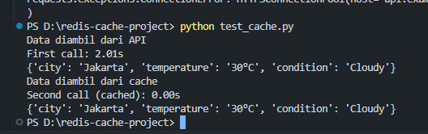
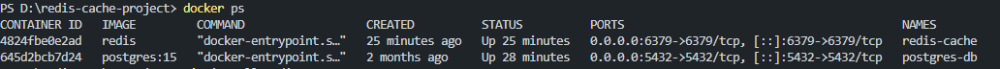
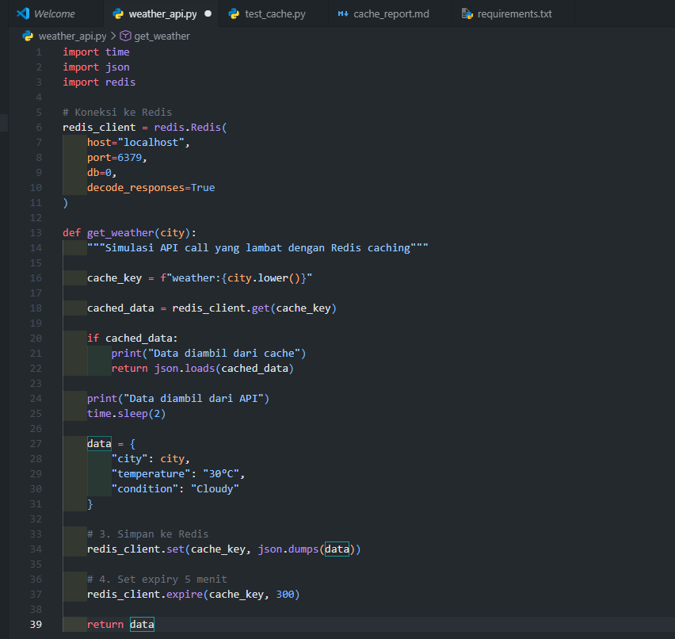

# 1. Tujuan Praktikum

Praktikum ini bertujuan untuk memahami konsep caching menggunakan Redis pada aplikasi Python. Dengan menggunakan caching, data yang sebelumnya membutuhkan waktu lama untuk diproses dapat disimpan sementara sehingga request berikutnya menjadi lebih cepat.

---

# 2. Tools dan Teknologi

Tools yang digunakan pada praktikum ini:

- Python 3
- Redis
- Docker
- Visual Studio Code
- Library Python:
  - redis
  - requests

---

# 3. Instalasi Redis

Redis dijalankan menggunakan Docker dengan command berikut:

```bash
docker run --name redis-cache -p 6379:6379 -d redis
```

Untuk memastikan Redis berjalan digunakan command:

```bash
docker ps
```
/
Hasil menunjukkan container Redis berjalan pada port 6379.

---

# 4. Install Dependency Python

Dependency diinstall menggunakan command berikut:

```bash
pip install redis requests
```

Isi file `requirements.txt`:

```txt
redis
requests
```

---

# 5. Kode Program

## weather_api.py

```python
import time
import json
import redis

# Koneksi ke Redis
redis_client = redis.Redis(
    host="localhost",
    port=6379,
    db=0,
    decode_responses=True
)

def get_weather(city):
    """Simulasi API call yang lambat dengan Redis caching"""

    cache_key = f"weather:{city.lower()}"

    # 1. Cek cache dulu
    cached_data = redis_client.get(cache_key)

    if cached_data:
        print("Data diambil dari cache")
        return json.loads(cached_data)

    # 2. Jika tidak ada cache, simulasi API call
    print("Data diambil dari API")
    time.sleep(2)

    # Simulasi data API
    data = {
        "city": city,
        "temperature": "30°C",
        "condition": "Cloudy"
    }

    # 3. Simpan ke Redis
    redis_client.set(cache_key, json.dumps(data))

    # 4. Set expiry 5 menit
    redis_client.expire(cache_key, 300)

    return data
```

## test_cache.py

```python
import time
from weather_api import get_weather

# First call - should be slow (2 seconds)
start = time.time()
result1 = get_weather("Jakarta")
time1 = time.time() - start
print(f"First call: {time1:.2f}s")
print(result1)

# Second call - should be fast (< 0.1 second)
start = time.time()
result2 = get_weather("Jakarta")
time2 = time.time() - start
print(f"Second call (cached): {time2:.2f}s")
print(result2)

# Third call after 5 minutes - should be slow again
# Tidak perlu menunggu 5 menit, cukup dijelaskan.
```

---

# 6. Hasil Testing

Berdasarkan hasil pengujian, pemanggilan pertama membutuhkan waktu sekitar 2 detik karena data belum tersedia di cache sehingga program mengambil data dari API.

Pemanggilan kedua menjadi jauh lebih cepat karena data sudah tersimpan di Redis cache.

## Output Program

```bash
Data diambil dari API
First call: 2.01s
{'city': 'Jakarta', 'temperature': '30°C', 'condition': 'Cloudy'}

Data diambil dari cache
Second call (cached): 0.00s
{'city': 'Jakarta', 'temperature': '30°C', 'condition': 'Cloudy'}
```

---

# 7. Redis Commands yang Digunakan

## GET

Digunakan untuk mengambil data dari Redis.

```bash
GET weather:jakarta
```

## SET

Digunakan untuk menyimpan data ke Redis.

```bash
SET weather:jakarta "{data cuaca}"
```

## EXPIRE

Digunakan untuk mengatur masa berlaku cache selama 300 detik.

```bash
EXPIRE weather:jakarta 300
```

## TTL

Digunakan untuk mengecek sisa waktu cache.

```bash
TTL weather:jakarta
```

---

# 8. Penjelasan Alur Program

1. Program menerima input nama kota.
2. Program membuat cache key berdasarkan nama kota.
3. Redis akan dicek menggunakan command `GET`.
4. Jika data tersedia di cache:
   - Data langsung dikembalikan dari Redis.
   - Response menjadi sangat cepat.
5. Jika data belum tersedia:
   - Program melakukan simulasi API call selama 2 detik.
   - Data kemudian disimpan ke Redis.
   - Cache diberikan waktu kedaluwarsa 300 detik.
6. Setelah 300 detik cache akan otomatis terhapus sehingga request berikutnya kembali mengambil data dari API.

---

# 9. Jawaban Pertanyaan

## Kenapa response time berbeda?

Response time berbeda karena pada pemanggilan pertama data belum tersedia di cache sehingga program harus melakukan simulasi API call yang membutuhkan waktu sekitar 2 detik.

Pada pemanggilan kedua, data sudah tersimpan di Redis sehingga program langsung mengambil data dari cache tanpa melakukan API call lagi.

## Apa keuntungan caching?

Keuntungan caching:

- Mempercepat response time aplikasi
- Mengurangi beban server
- Mengurangi jumlah request ke API
- Membuat aplikasi lebih efisien
- Menghemat penggunaan resource
- Mengurangi latency aplikasi

## Kapan sebaiknya tidak menggunakan cache?

Cache sebaiknya tidak digunakan pada:

- Data yang harus selalu real-time
- Data yang sangat sering berubah
- Sistem transaksi keuangan
- Informasi stok real-time
- Data autentikasi penting
- Data sensitif

---

# 10. Kesimpulan

Implementasi Redis caching berhasil mengurangi response time secara signifikan. Pemanggilan pertama membutuhkan sekitar 2 detik karena data diambil dari API, sedangkan pemanggilan kedua jauh lebih cepat karena data sudah tersimpan di Redis cache.

Dengan menggunakan Redis, performa aplikasi menjadi lebih efisien karena request yang sama tidak perlu melakukan proses API call berulang kali.

---

# 11. Screenshot Dokumentasi

## Screenshot Hasil Testing



Pada screenshot di atas terlihat bahwa pemanggilan pertama membutuhkan waktu sekitar 2 detik karena data masih diambil dari API. Pemanggilan kedua menjadi sangat cepat karena data sudah tersimpan di Redis cache.

---

## Screenshot Redis Berjalan



Screenshot di atas menunjukkan bahwa container Redis berhasil berjalan menggunakan Docker pada port 6379.

---

## Screenshot Kode Program



Screenshot di atas menunjukkan implementasi fungsi caching menggunakan Redis pada file `weather_api.py`.